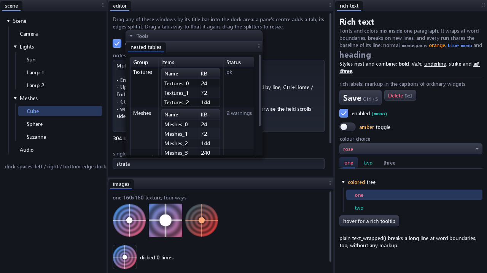
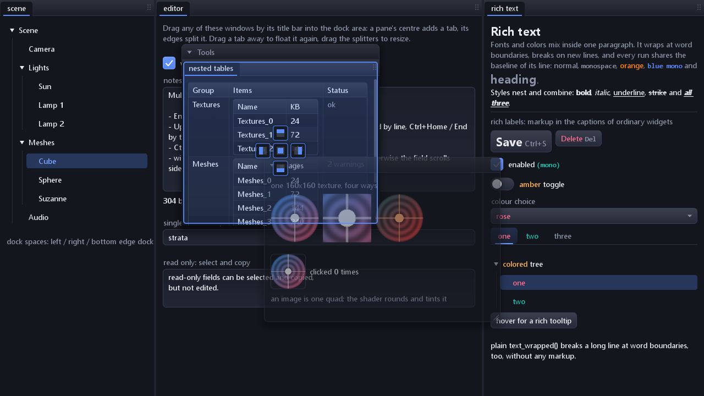
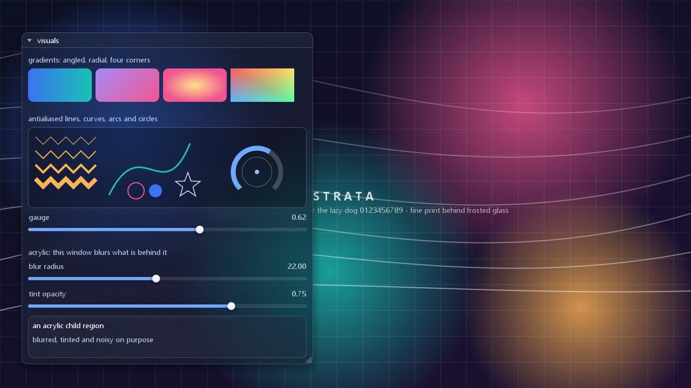
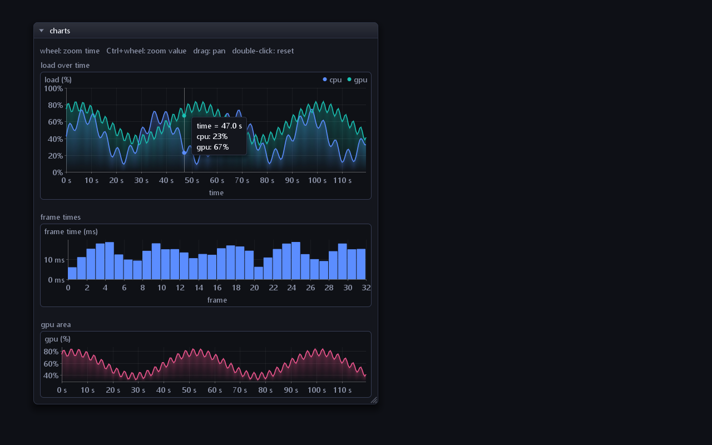
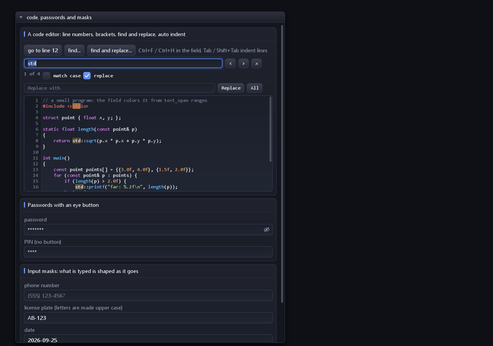
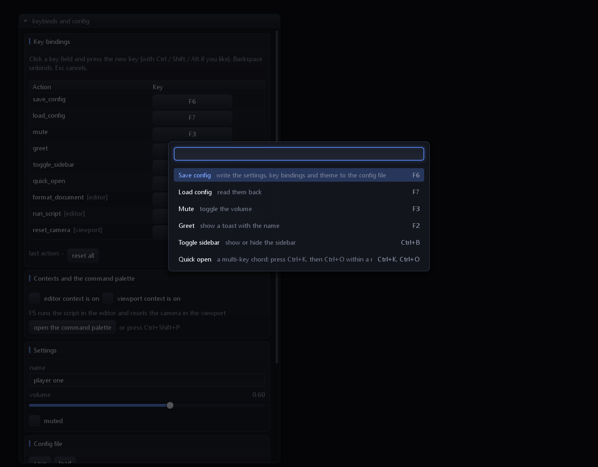
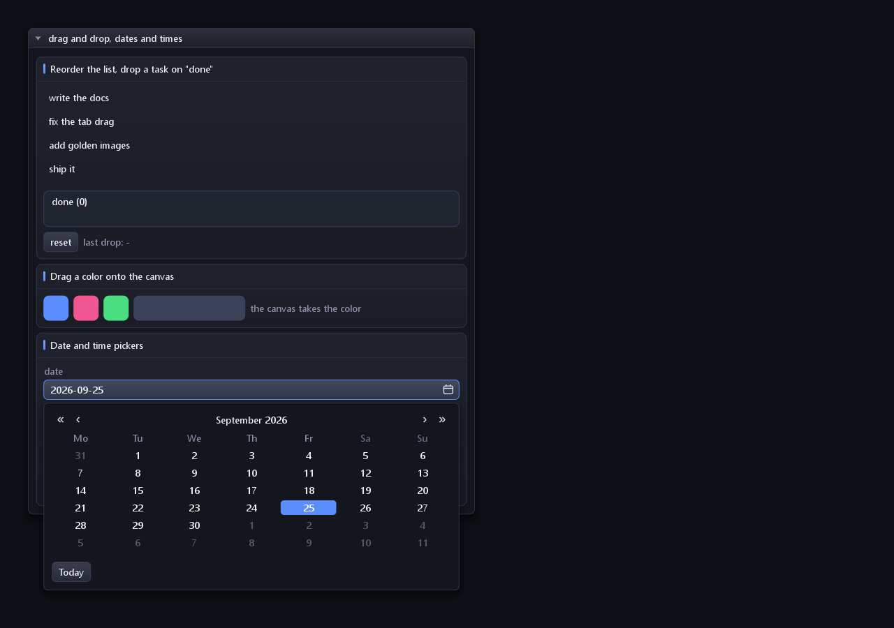
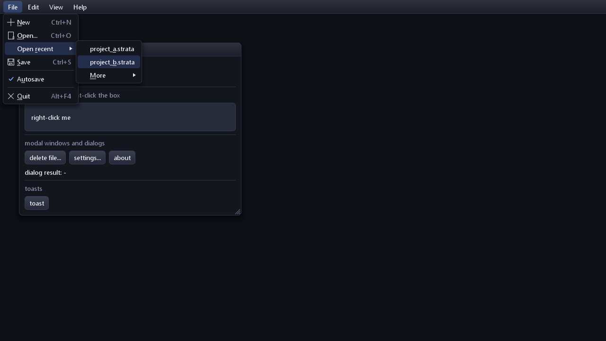
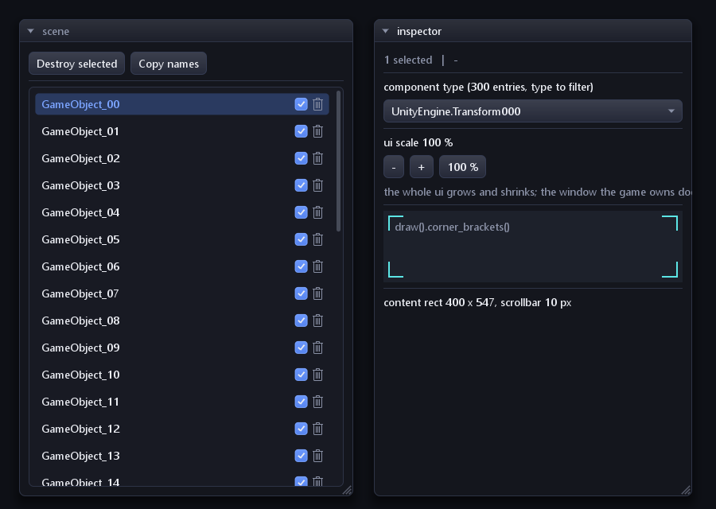

# strata

Immediate-mode UI framework for Direct3D 11 and 12. C++ latest (`/std:c++latest`), CMake 4.3+, Windows x64, MSVC.



```
strata/    the library  (strata::strata, static)
sandbox/   test application, same UI on d3d11 or d3d12
cmake/     options, compile flags, hlsl embedding, package config
```

## Screenshots

All rendered by the sandbox (`strata_sandbox --scene NAME --shot FILE`) on Direct3D 11.

| | |
|---|---|
| <br>**Docking** -- a window dragged over a pane shows drop guides | <br>**Acrylic** -- gradients, antialiased curves, frosted glass (`glass` theme) |
| <br>**Charts** -- ticks, units, area fills, hover readout, zoom / pan | <br>**Code editor** -- highlighting, find / replace, passwords, input masks |
| <br>**Command palette** -- rebindable keys, multi-key chords, fuzzy search | <br>**Drag and drop, date picker** |
| <br>**Menus** -- mnemonics, accelerators, icons, submenus | <br>**App-shaped UI** -- row accessories, filtered combo, corner brackets |

## Build

| Where | How |
|---|---|
| VS Code | open the folder with the *CMake Tools* extension, pick a preset (`x64-debug` / `x64-release`), build; F5 launches `sandbox (dx11)` / `sandbox (dx12)` |
| Visual Studio | *Open Folder* on this directory (Ninja presets), **or** generate a solution: `cmake --preset vs2022` then open `build/vs2022/strata.sln` |
| Terminal | `build_vs.cmd x64-release` (loads the VS x64 environment, configures, builds) |

*Open Folder* uses Visual Studio's bundled CMake, which must be >= 4.3; otherwise generate the solution with the
`vs2022` preset from a CMake 4.3 command line.

Options (`-D`): `STRATA_BUILD_DX11`, `STRATA_BUILD_DX12`, `STRATA_BUILD_SANDBOX`, `STRATA_STATIC_CRT` (/MT),
`STRATA_FAST_MATH` (/fp:fast), `STRATA_AVX2` (/arch:AVX2), `STRATA_WERROR`, `STRATA_INSTALL`, `STRATA_BUILD_TESTS`.

Tests: `ctest --test-dir build/x64-release` runs the headless self-test and compares sandbox screenshots with
`tests/golden/*.png` (`-L gpu` selects only those; they need a desktop session and a gpu). After an intended visual
change, `cmake --build build/x64-release --target strata_update_goldens` rewrites them (review the image diff!).
Goldens are machine-specific: other fonts need their own.

Requirements: `STRATA_AVX2` is off by default, so binaries run on any x64 CPU. With it on they fault on CPUs without
AVX2 (pre-2013 Intel / pre-2015 AMD) -- only for programs that control their machines, never an overlay dll.
`fxc.exe` (Windows SDK) compiles the shaders at build time and embeds the bytecode: no shader files or
`d3dcompiler` DLL at runtime.

## Sandbox

```
strata_sandbox.exe [options]        (strata_sandbox.exe --help lists everything)

  --dx11 | --dx12          graphics backend (default dx11)
  --vsync | --novsync      present interval
  --fps N                  frame cap, 0 = unlimited (default: display refresh; some drivers ignore vsync)
  --width N --height N     client size (default 1280x720)
  --frames N               exit after N frames (smoke test)
  --stress N               buttons in the stress window (default 60)
  --theme N|NAME           a built-in theme by index or name (midnight, light, ocean, rose, dracula, nord, solarized_dark,
                           solarized_light, high_contrast, forest, amber, glass);  --theme-file FILE applies a theme file on top
  --scale F                ui scale (default: the monitor's dpi scale; --width / --height are logical pixels)
  --scene NAME             only one scene: default, features, visuals, inputs, multiselect, charts, textures, scripts, textlog, menus, context, modal, toasts, config, palette, tabs, dnd, lists, editor, icons, bigtree, rows, app, ...
  --icon-page HEX          with --scene icons: a raw page of 256 code points with their hex values, for picking one
  --menu                   only the sidebar settings-menu example
  --features               only the docked feature windows: multi-line input, rich text, images, nested tables
  --selftest               headless checks of the ui logic (text editing, docking, menus, modals, ...), exit code 0 = passed
  --shot FILE              render --shot-frames (24) fixed 1/60 s steps, save the last frame as a png (read back from the gpu) and exit
  --golden FILE            the same, but compare with the png FILE; exit code 0 = match (--update-golden rewrites it)
  --log FILE               stderr (D3D debug layer messages in Debug builds, frame report) to a file
  --metrics                strata's own inspector windows: frame cost, geometry, culling, idle state, and in red
                           anything that went wrong quietly; plus the live draw commands, one row each
  --idle                   skip rendering and presenting while the ui reports nothing changed; the frame report
                           then says how many frames were skipped (try `--scene icons --idle --frames 300`)

  --font FILE | --face NAME --size PX          primary font (id 0)
  --mono FILE|NAME --mono-size PX              second font (id 1, default Consolas 13)
  --heading FILE|NAME --heading-size PX        third font (id 2, bold, default Segoe UI 22)
  --icons FILE|NAME --icon-size PX             icon font (id after the extras; default Segoe MDL2 Assets,
                                               then Segoe Fluent Icons, then none), --no-icons
  --no-extra-fonts   --cjk   --no-kern
```
Esc closes the window. Click a window to raise it ("overlap A / B" show the stacking). "show feature windows
(docking)" docks the feature windows into left / right / bottom edge docks, the client area and a floating "Tools"
dock; drag them around freely.

## Using the library

```cpp
auto ui = strata::context::create().value();          // builds the font atlas
strata::win32_platform platform;  platform.attach(hwnd);   // forward WM_* to platform.handle_message()

strata::d3d11_renderer renderer;                       // or d3d12_renderer
renderer.create(device, device_context, ui.font());

// every frame
ui.begin_frame(platform.new_frame());
if (auto w = ui.window("debug", {24, 24}, 300)) {
    ui.textf("{:.1f} fps", fps);
    ui.checkbox("enabled", enabled);
    ui.slider("speed", speed, 0.0f, 4.0f);
    if (ui.button("reset")) { /* ... */ }
}
ui.end_frame();
// bind your render target, then:
renderer.render(ui.render_data());
```

`d3d11_renderer::render` saves and restores every pipeline stage it touches. `d3d12_renderer::render` records into
your open command list and expects the usual frames-in-flight fence discipline.

## Design notes

- **No heap traffic in steady state.** Vertex / index / command arrays are `vmem_array`s: reserved address space
  committed in 64 KiB chunks, never moved, cleared per frame.
- **Logical pixels.** Layout is in logical pixels; the draw list scales on output, so renderers see only physical
  pixels (see *DPI and UI scale*).
- **16-byte vertex** (`float2` pos, `unorm16x2` uv, `rgba8`), one atlas, one shader pair; draws merge per clip rect
  (an image takes its own command).
- **16-bit indices** relative to each command's `vtx_offset` (`BaseVertexLocation`), halving index bandwidth. A
  command spans at most 65536 vertices and is split beyond that like on a clip / texture change; text, polylines and
  area fills emit in chunks.
- **Nothing changed, nothing sent.** `end_frame` hashes the geometry; `ui.can_idle()` is true when the frame is
  identical and no animation is moving, and renderers skip the upload when they already hold it (see *Idling*).
- **Analytic rounded shapes.** One quad per shape (80-byte record); the pixel shader evaluates an SDF with per-corner
  radii, angled / radial gradient, inner border and soft shadow. Plain axis-aligned rects take a 4-vertex fast path.
- **Animated widgets** (hover / press / toggle) via a small fixed hash table keyed by widget id.
- **No exceptions, no RTTI**, static CRT, `/GL` + `/LTCG` in release, windows.h kept out of public headers.

## Widgets

```cpp
ui.button("save");                       ui.icon_button(icon_font, strata::icons::save, "Save");
ui.checkbox("enabled", flag);            ui.toggle("dark mode", flag);
ui.slider("speed", value, 0.0f, 4.0f);   // caption + value above, thin track, round knob (float or integer)
ui.progress_bar(0.4f);                   ui.separator();  ui.spacing();  ui.same_line();

std::string name;
ui.input_text("name", name, "hint text");                              // std::string, grows as needed
ui.input_text("pin", pin, "secret", strata::input_flags::password);    // masked, copy/cut disabled
ui.input_text("code", buf, sizeof buf);                                // fixed char buffer
if (ui.input_submitted()) { /* enter was pressed */ }

std::string notes;
ui.input_multiline("notes", notes, {0, 160});                          // several lines, wraps, scrolls, undo / redo

int mode = 0;
ui.combo("mode", mode, {"fast", "balanced", "quality"});               // returns true on change

int tab = 0;
ui.tab_bar("tabs", {{"General", icons::settings}, "Advanced", "About"}, tab, icon_font);
switch (tab) { /* draw the content of the selected tab */ }
```

- **Text input:** UTF-8 aware. Click / drag, double-click (word), triple-click (line), arrows, Home / End,
  Ctrl+arrows, Shift to extend, Backspace / Delete, Ctrl+A / C / X / V, **Ctrl+Z undo, Ctrl+Y / Ctrl+Shift+Z redo**.
  `win32_platform` feeds `input_state::keys` / `typed` from `WM_KEYDOWN` / `WM_CHAR`; `ui.set_clipboard(platform.clipboard())`
  enables copy / paste. `ui.want_text_input()` is true while a field has focus.
- **Undo / redo:** up to 256 steps / 1 MiB per focused field. Typing or deleting within a second is one step; paste,
  cut and replaced selections are their own. The history lives only while focused, in zeroed-on-free memory;
  password fields keep none.
- **Multi-line input:** `ui.input_multiline(label, text, size, flags, hint, max_bytes)` for `std::string` or
  `secure_string`. Enter = newline (Ctrl+Enter is `input_submitted()`), Up / Down keep the column, Page Up / Down,
  Home / End (line), Ctrl+Home / End (text), Tab inserts four spaces, mouse selection, wheel and scrollbar. Wraps at
  words unless `input_flags::no_wrap` (scrolls sideways); `read_only` gives a copyable view. Pasted line breaks are
  normalised to `\n`, tabs become spaces. Lines are recomputed only when text, width or font change.
- **Combo box:** drawn above every window, flips up near the bottom, scrolls past 8 rows, Up / Down / Enter / Esc; a
  click outside only closes it.
- **Tabs:** header row with a sliding highlight; you draw the selected content.
- **Icons:** bake `glyph_ranges::private_use` from an icon font (Segoe MDL2 Assets / Segoe Fluent Icons ship with
  Windows; `font_config::exact_face` makes a missing font an error) and use `strata/icons.hpp`, or any code point as
  `strata::glyph_string{0xe80f}`.

## Color, trees, tables

```cpp
// color picker: swatch that opens a popup, or the picker inline
ui.color_edit("accent", accent, strata::color_flags::no_alpha);
ui.color_picker("tint", tint);

// trees and selectable lists; open state persists per node
if (auto scene = ui.tree("Scene", strata::tree_flags::default_open)) {
    if (ui.tree_leaf("Camera", selected == "Camera")) { selected = "Camera"; }
    if (auto lights = ui.tree("Lights")) { /* ... */ }
}                                            // or tree_node(...) + tree_pop()

// tables: fixed / stretch columns, sticky sortable header, resizable, striped, optional scrolling body
if (ui.begin_table("files", 3, strata::table_default, /*scroll height*/ 240.0f)) {
    ui.table_setup_column("Name", 0.0f, 1.5f);   // stretch, weight 1.5
    ui.table_setup_column("Size", 80.0f);        // fixed 80 px
    ui.table_setup_column("Type");
    int clicked = ui.table_headers_row(sort_column, ascending);   // column clicked this frame, or -1
    for (auto& row : rows) {
        if (!ui.table_next_row()) { continue; }  // false for rows scrolled out of view: skip their cells
        ui.table_next_column();  ui.selectable(row.name, row.selected);
        ui.table_next_column();  ui.textf("{} KB", row.size);
        ui.table_next_column();  ui.text_ellipsis(row.type);
    }
    ui.end_table();
}
```

- **Color picker:** SV square, hue bar, alpha bar, preview and a hex field (`#rgb`, `#rgba`, `#rrggbb`, `#rrggbbaa`).
  Keeps its own HSV while dragging, so greys keep their hue. `color_edit` shows it in a popup.
- **Popups:** `begin_popup_at` / `end_popup` (behind the combo and color popups) draw above every window with the
  layout redirected inside, so any widget works there.
- **Trees:** guide lines, animated arrow, `arrow_only` (read the row with `ui.item_pressed()`), `selected`,
  `default_open`. `selectable` is the same row without children.
- **Off-screen rows cost nothing.** `selectable`, `tree_leaf`, `tree_node`, `table_tree_*` and `custom_item` advance
  the layout, then stop if outside the clip rect: no hit test, animation slot, measuring or geometry. Scrollbar range,
  open state and nesting are unaffected, and nothing has to opt in. This makes deep trees of mixed row height
  affordable: `--scene bigtree` (5 704 nodes, all expanded) takes 0.4 ms a frame with 22 rows drawn.
- **Row identity without strings.** Extra-id overloads take the identity separately (hashed after the label, never
  shown); `push_id` also takes a pointer, `u64` or `int`:

```cpp
ui.selectable(node.name, {reinterpret_cast<const char*>(&node.id), sizeof(node.id)}, node.id == selected);
ui.tree_node(ns.name, ns.full_path, tree_flags::default_open);
ui.push_id(&object);  /* rows of this object */  ui.pop_id();
```
- **Opening and closing:** `set_next_item_open(bool)` / `set_next_item_open_recursive` override the next node;
  Ctrl / Shift + arrow click applies to the subtree; `open_all_tree_nodes()` / `close_all_tree_nodes()` cover the
  current id scope and keep applying until the tree fully unfolds.
- **Tables:** widths are fractions of the table width (survive resizing; drag-resizing keeps the total). Cells clip
  to their column. With a height the body scrolls under a fixed header; `table_next_row()` is false for rows out of
  view. Row backgrounds use the previous row's height (mixed heights are off for one row).
- **Nested tables:** up to five levels; the outer row grows to fit. Tables repeated per row need distinct ids:
  `ui.push_id(row_key); if (ui.begin_table("items", 2)) {...} ui.pop_id();`. The wheel goes to the innermost
  scrollable region under the pointer.

## Images and docking

```cpp
// images: the renderer owns the texture (rgba8, straight alpha); the ui only draws it
strata::texture_id tex = renderer.create_texture(w, h, pixels);        // d3d11_renderer / d3d12_renderer, 0 on failure
ui.image(tex, {96, 96});                                               // size.x == 0: layout width, size.y == 0: square
ui.image(tex, {96, 96}, {0.25f, 0.25f}, {0.75f, 0.75f}, tint, /*rounding*/ 12.0f);   // crop, tint, round corners
if (ui.image_button("open", tex, {64, 64})) { /* clicked */ }
ui.draw().image(rect, tex, uv0, uv1, tint, strata::radii(8));          // or straight into the draw list
renderer.destroy_texture(tex);                                         // d3d12: after the gpu is done with it

// other formats, mip maps, updates
strata::texture_desc d{w, h, strata::texture_format::bgra8, /*mip_levels: 0 = the whole chain*/ 0, /*updatable*/ true};
strata::texture_id dyn = renderer.create_texture(d, pixels);           // rgba8 bgra8 r8 a8 rgba16f
renderer.update_texture(dyn, x, y, rw, rh, new_pixels);                // a rectangle, in the texture's format; the mips follow

// docking: regions that windows can be dropped into (every frame, before the windows)
strata::rect client{{0, 0}, ui.display_size()};
client = ui.dock_edge("explorer",  strata::dock_side::left,   260, client);   // side panels: take room only while used
client = ui.dock_edge("inspector", strata::dock_side::right,  320, client);
client = ui.dock_edge("console",   strata::dock_side::bottom, 200, client);
ui.dock_area(client);                                                      // the main space: what is left
ui.floating_dock("Tools", {330, 80}, {360, 330});                          // a movable panel that windows dock into
if (auto w = ui.window("inspector", {40, 40}, {300, 400}, strata::window_flags::dockable | strata::window_flags::resizable)) { /* ... */ }
ui.dock_window("inspector", strata::dock_zone::right, "viewport", 0.3f);    // optional: a default layout
ui.dock_window("log", strata::dock_zone::center, {}, 0.5f, "console");     // ... or straight into a space

std::string layout = ui.dock_save_layout();      // the whole arrangement as text: keep it in a file / settings blob ...
ui.dock_load_layout(layout);                     // ... and bring it back (before or after the windows were shown)
```

- **Images:** one quad each, corners rounded by the same SDF as shapes, so rounding, tint and crop are free. d3d11
  keeps a list of SRVs; d3d12 a descriptor-heap slot (255 textures). A command whose texture was destroyed draws
  nothing.
- **Texture formats:** `rgba8`, `bgra8` (decoder / GDI order), `r8` (opaque grey), `a8` (white with that alpha, so
  `tint` colors it) and `rgba16f` (0..1 displayed). `r8` / `a8` are expanded to rgba8 on the cpu.
- **Mip maps:** `mip_levels` = 1 (none), 0 (full chain) or n. Built on the cpu with an alpha-weighted 2x2 box filter;
  the shader samples trilinearly, so heavily shrunk images do not shimmer.
- **Texture updates:** `updatable` textures keep a cpu copy (otherwise wiped after upload).
  `update_texture(id, x, y, w, h, pixels)` replaces a rectangle and rebuilds only the touched mip regions (d3d11
  `UpdateSubresource`; d3d12 staged, frames in flight undisturbed). `strata::texture_image` (`strata/texture.hpp`)
  is the cpu side for custom renderers.
- **Docking:** drag a `window_flags::dockable` window by its title over a dock area: a pane's centre adds a **tab**,
  its edges **split** it, the area border splits the whole tree. Docked windows get a tab bar instead of a title,
  cannot move / resize themselves, and sit below floating ones. Drag splitters to resize, drag a tab away to float
  it. A window not submitted for a frame leaves its dock. `dock_window` / `undock_window` / `is_docked` /
  `window_rect` do it from code. Up to 32 panes; with no space, docked windows float where they were.
- **Docking comfort:** **drop guides** (a centre cross per pane, one per border of a big space) highlight with the
  preview. Dropping on a **tab bar** inserts at the pointer. Drag tabs along the bar to **reorder**, off it to tear
  off. **Double-click** a tab to float it, a splitter / edge handle to reset it. **Shift** drags without docking,
  **Esc** cancels docking.
- **Dock spaces:** up to 8, each with its own pane tree: `dock_area(rect)` (main), `dock_area("name", rect)`,
  `dock_edge(name, side, size, region)` (a side panel returning the remaining region, so they chain; empty ones take
  no room and show a drop strip while dragging), and `floating_dock(title, pos, size)` (a window that is a space).
- **Whole panes:** the space right of a pane's tabs is a grip (six dots) that drags the whole pane; its tabs join or
  split the target together, keeping order and selection. Dropped over no dock, they float, fanned out.
- **Saving a layout:** `dock_save_layout()` returns text (`strata-dock 2`: per space its splits, ratios, tabs,
  selection and edge size; per window position, size, collapsed). `dock_load_layout(text)` matches by name, skips
  unknown windows and floats missing ones; invalid text, more than 32 panes, or a `strata-dock 1` layout (pre
  64-bit ids) return false and change nothing.

## DPI and UI scale

```cpp
ui.set_scale(platform.dpi_scale());        // 1.0 = 96 dpi, 1.5 = 144 dpi ...  (rebuilds the font atlas)
renderer.update_atlas(ui.font());          // d3d11 / d3d12: upload it
ui.release_font_pixels();
// on WM_DPICHANGED: the same three lines with the new platform.dpi_scale()
```
Everything you specify stays in logical pixels; mouse and display size arrive physical and are converted, draw
commands leave physical, and glyphs are rasterised at `scale` times their size, so text stays sharp. `font_atlas`
offers both (`measure` / `line_height` logical, `*_px` physical). A rescale costs one atlas rebuild (0.3 s for the
sandbox's four fonts); font `ranges` / `data` given to `create()` must outlive the context. The dpi scale is a good
default but a poor setting: see *UI scale at runtime*.

## Drawing: gradients, curves, acrylic

```cpp
dl.rect_gradient_angle(r, from, to, /*degrees*/ 45.0f, /*rounding*/ 10.0f);   dl.rect_gradient_radial(r, centre, edge, 10.0f);
dl.polyline(points, color, /*thickness*/ 2.0f, /*closed*/ false);             dl.bezier_cubic(p0, p1, p2, p3, color, 3.0f);
dl.arc(centre, radius, a0, a1, color, 8.0f);     dl.circle(c, r, color, 1.0f);   dl.circle_filled(c, r, color);
dl.backdrop(rect, /*blur*/ 18.0f, /*tint*/ color, radii(10.0f));                   // frosted glass
ui.window("glass", pos, size, strata::window_flags::acrylic);                        // or child_flags::acrylic
```
- **Gradients:** `shape_style::gradient_dir` (any direction; `gradient_direction(degrees)`) and `radial`, from
  `fill_top` to `fill_bottom`. Still one quad.
- **Lines and curves:** `polyline` is a mitred strip with a one-pixel AA fringe (butt ends); curves and arcs
  tessellate to it. `polygon_filled` fills convex polygons.
- **Acrylic / blur:** a backdrop copies the target, downsamples (1/2 or 1/4), applies a separable gaussian (2-6
  passes) and draws a rounded, tinted (`window_bg` alpha * `acrylic_alpha`), grained (`acrylic_noise`) panel.
  Consecutive panels share a blur. `style.blur_radius` sets the radius. d3d12 needs
  `renderer.render(data, list, frame, &d3d12_target{resource, rtv_handle_ptr})`; without it (or with MSAA) panels are
  flat tints. Theme `glass` is made for it.
- **Saturation / brightness:** `acrylic_saturation` (0 grey, 1 as is, > 1 vivid) and `acrylic_brightness` re-grade
  the blurred frame.
- **Glass popups:** `style.popup_acrylic` (0 opaque, 1 glass) frosts menus, dropdowns, tooltips and toasts (opaque
  while fading in). All of these are theme-file keys.

## Themes and theme files

```cpp
ui.theme() = strata::themes::nord();                 // 12 built in: midnight light ocean rose dracula nord solarized_dark
strata::themes::by_name("forest", ui.theme());       // solarized_light high_contrast forest amber glass; themes::names()
strata::themes::save_file("my.theme", ui.theme(), "my theme");
strata::themes::theme_result r;  strata::themes::load_file("my.theme", ui.theme(), &r);   // r.applied / unknown / invalid / first_problem_line
```
Theme files are `key = value` lines (`#`, `;`, `//` comments), colors `#rgb` / `#rgba` / `#rrggbb` / `#rrggbbaa`,
and an optional first `base = nord` line to override just a few keys. Keys are the `style` members. `to_string` /
`from_string` work in memory; the sandbox has save / load buttons and `--theme` / `--theme-file`.

## Key bindings and config files

```cpp
strata::keybinds binds;
binds.add("save", "Ctrl+S", "write the document");      // name, default chord, tooltip
binds.add("quick_open", "Ctrl+P");
binds.add("goto_symbol", "Ctrl+K, Ctrl+O");              // a short sequence: Ctrl+K, then Ctrl+O

if (binds.pressed(ui, "save")) { save(); }               // true on the frame the chord is pressed
(void)ui.menu_item("Save", binds.text("save"));          // "Ctrl+S" as the shortcut hint
strata::keybind_editor(ui, binds);                       // a table: click a field, press the new chord

strata::config cfg;                                      // ini-like: [sections] and key = value lines
binds.store(cfg);                                        // [keybinds]  save = Ctrl+S
strata::themes::to_config(cfg, ui.theme());             // [theme]     accent = #5b8dff ...
cfg.set_float("app", "volume", 0.6f);
cfg.save_file("settings.ini");
// later: register the actions, then
cfg.load_file("settings.ini");
binds.load(cfg);  strata::themes::from_config(cfg, ui.theme());  volume = cfg.get_float("app", "volume", 1.0f);
```
- **Chords:** `key_chord{key, ctrl, shift, alt}`, a virtual-key code (or side mouse button) with exact modifiers.
  `chord_to_string` / `chord_from_string` use the `accelerator()` syntax (`"Ctrl+Shift+S"`, `"Page Up"`,
  `"Mouse 4"`). Plain keys are ignored while a text field has the keyboard; nothing fires while a hotkey field
  captures.
- **Multi-key chords:** a `key_sequence` is up to 3 chords ("Ctrl+K, Ctrl+S"), each within `key_sequence_timeout`
  (1.5 s). A `key_chord` converts to a one-step sequence, so it drops in anywhere (`keybinds::action::chord` is a
  `key_sequence`). `ui.sequence_pressed(seq)` fires on the last step; a non-matching key keeps the prefix one more
  frame so sequences sharing it ("Ctrl+K, Ctrl+S" / "Ctrl+K, Ctrl+O") all get to check it.
  `ui.hotkey_sequence("Label", seq)` captures: each key commits at once, another within the timeout extends it; a
  bare Esc / Backspace / Delete as the first key cancels / unbinds.
- **keybinds:** `bind` / `reset` / `reset_all`, `conflict(name)`, `find`, `actions()`. `keybind_editor` shows reset
  buttons and conflict marks; Backspace / Delete unbinds.
- **config:** case-insensitive sections and keys, order kept, one-line values; typed getters take a fallback. Keys
  before the first header are in section `""`. `from_string` merges and returns the unreadable line count; paths are
  utf-8. Unbound actions are stored as empty values, so "unbound" survives a reload.
- **Contexts:** `binds.add("format", "Ctrl+Shift+F", "format the selection", "editor")` works (and shows in the
  palette) only while `binds.set_context("editor", editor_has_focus)` is on; set it every frame. Different contexts
  may share chords; an active context action beats a global one.
- **Command palette:** `strata::command_palette palette; if (auto cmd = palette.show(ui, binds); !cmd.empty()) run(cmd);`
  -- a modal fuzzy search (`fuzzy_score`) over available actions. Ctrl+Shift+P (`palette.shortcut`) or
  `palette.open()`; Up / Down / Enter / click, Esc. Call `show()` once per frame outside any window.
- **config_file:** `strata::config_file settings{"settings.ini"}; settings.load();` binds a config to a file. Opt-in
  `set_auto_save(true)` (writes shortly after changes and on destruction) and `set_hot_reload(true)` (re-reads on
  disk change). Call `if (settings.update(dt)) apply(settings.data());` per frame. Use its setters (or `touch()`
  after editing `data()`). Unsaved changes are never overwritten by a reload.
- `--scene config` / `--scene palette` show all of it (F2 / F3 / F6 / F7 are its default actions).

## Tabs, popups and status widgets

```cpp
std::vector<std::string> docs{"main.cpp", "notes.txt"};   int current = 0;
std::vector<tab_desc> tabs;  for (auto& d : docs) tabs.emplace_back(std::string_view{d});
auto ev = ui.tab_bar("docs", tabs.data(), tabs.size(), current,
                     tab_bar_flags::closable | tab_bar_flags::reorderable | tab_bar_flags::add_button);
if (ev.add) { docs.push_back("untitled"); current = int(docs.size()) - 1; }
apply_tab_events(ev, docs, current);        // removes a closed tab, applies a drag, keeps `current` on its tab

if (ui.button("options")) { ui.toggle_popup("opts"); }          // a popup: any widgets, closes on Esc / a click outside
if (auto p = ui.popup("opts", 260)) { ui.checkbox("wrap", wrap); if (ui.button("done")) { ui.close_popup(); } }
ui.open_popup("menu", ui.mouse_pos());                           // or at a position

ui.spinner();  ui.same_line();  ui.text("syncing...");
ui.badge("3", toast_kind::warning);   ui.badge("beta", color{178, 120, 255, 255});
auto r = ui.chip("filter", {.closable = true, .selected = &on});    // r.clicked / r.closed
```
- **Tabs:** `tab_bar` reports `changed`, `closed`, `moved_from` / `moved_to`, `add`; `apply_tab_events` updates your
  list. Overflowing tabs scroll (wheel) and get a list button.
- **Popups:** `open_popup` / `toggle_popup` / `popup` (or `begin_popup` / `end_popup`) / `close_popup` /
  `close_all_popups` / `popup_is_open`. Opens under `last_item_rect()` or at a position, sized to content, above all
  windows. Popups stack (up to 4 levels): a popup, dropdown, picker or context menu opened from inside a popup opens on
  top of it and the parent stays open. A click in a popup closes the ones above it, a click outside closes them all,
  Esc closes the top one. Opened from outside every popup, one replaces what was open.
- **Status widgets:** `spinner`, `badge` (`kind_color(kind, theme)`), `chip` (`closable`, `selected`, `tint`, `icon`).
- `--scene tabs` shows it all.

## Drag and drop, date and time pickers

```cpp
ui.selectable(task.name);
if (auto d = ui.drag_source("task", index)) { ui.text(task.name); }      // the preview that follows the pointer
...
ui.selectable(other.name);
const drop_result drop = ui.drop_target("task", drop_flags::no_highlight);
if (drop.hovering) { /* draw an insert marker: drop.local.y < 0.5 is the upper half */ }
if (drop)          { move_task(drop.as<int>(), position); }                 // the payload

strata::date d{2026, 9, 25};  strata::time_of_day t{13, 45, 0};
ui.date_picker("date", d);  ui.time_picker("time", t, /*seconds*/ true);  ui.datetime_picker("both", d, t);
```
- **Drag and drop:** the payload is a small typed copy of your data; targets accept one type. Drags start after a
  few pixels, Esc cancels, and the release is not a click. Targets outline themselves (`drop_flags::no_highlight`
  off). Unscoped: `begin_drag_source` / `set_drag_payload` / `end_drag_source`; `dragging()`, `drag_payload_type()`.
- **Pickers:** a month calendar (month / year arrows, today marked, Today button) or hour / minute (/ second) grids.
  `datetime.hpp`: `date`, `time_of_day`, `days_in_month`, `weekday`, `add_days`, `add_months`, `parse_date` /
  `parse_time`, `to_string`, and `override_clock(...)` for tests.
- `--scene dnd` shows both.

## Long lists and tables

```cpp
strata::list_clipper clip(ui, rows.size(), ui.frame_height());          // rows of one height, in a scrolling area
while (clip.step()) for (int i = clip.begin(); i < clip.end(); ++i) { draw_row(rows[i]); }

ui.begin_table("files", 5, table_default | table_flags::hideable | table_flags::reorderable);
ui.table_setup_column("Name", 0, 1, table_column_flags::no_hide | table_column_flags::no_reorder);
ui.table_setup_column("Path", 0, 1, table_column_flags::default_hidden);      // ... the other columns
// right-click the header: a menu of columns; drag a header: move the column
std::string saved = ui.table_save_layout("files");                            // order, widths, hidden: text for a config file
ui.table_load_layout("files", saved);                                         // may be called before the table is first shown

// a tree table: expandable nodes in a cell, the children are the rows that follow
ui.table_next_row(); ui.table_next_column();
if (ui.table_tree_node("src", tree_flags::default_open)) {
    ui.table_next_row(); ui.table_next_column(); (void)ui.table_tree_leaf("main.cpp");
    ui.table_tree_pop();
}
```
- **list_clipper** submits only visible rows and reserves space for the rest (100 000 rows cost a handful). Works in
  fixed-height windows, `child` regions and tables with a height (`table_skip_rows(n)` by hand). Uniform rows only.
- **Table columns:** fill cells in declared order; `table_next_column()` is false for hidden ones and
  `table_headers_row` returns declared indices. Flags: `default_hidden`, `no_hide`, `no_reorder`.
- **Tree tables:** `table_tree_node` / `table_tree_leaf` / `table_tree_pop` draw arrows, indent and keep open state.
- **Auto-height windows** stop at the display bottom and scroll.
- **Mixed-height rows** need no clipper: they are culled individually (see *Color, trees, tables*).
  `ui.skip_item(h)` / `ui.skip_items(n, h)` reserve space for self-culled runs.
- **Scrolling from code**, for the innermost region: `scroll_y()`, `scroll_max_y()`, `set_scroll_y()`,
  `scroll_to_top()` / `scroll_to_bottom()`, and `ensure_item_visible()` / `scroll_to_item()` for the last row (call
  every frame to follow a selection; applies next frame).
- **Sideways scrolling** is opt-in: `ui.begin_child("pane", size, strata::child_flags::horizontal)`. Wider content
  gets a bottom bar, the tilt wheel (`input_state::wheel_x`) and Shift + wheel; `scroll_x()`, `scroll_max_x()`,
  `set_scroll_x()`. Full-width widgets still fit the visible width. Windows and tables do not scroll sideways
  themselves; put them in a horizontal child.
- **Keyboard navigation** is opt-in: between `nav_begin()` / `nav_end()` (or `auto n = ui.navigation("id");`) Up /
  Down move a cursor, Home / End, PageUp / PageDown (10), Left / Right close / open or step out / in, Enter acts like a
  click. Clicks move the cursor; the focused row reports `item_focused()` and draws a ring; the view follows. Inactive
  while a text field has the keyboard (`nav_active()`).
- `--scene lists` shows the tables, `--scene bigtree` the deep tree with a live `ui.stats()` panel.

## Rows: overlapping items, right-aligned controls, diagnostics

```cpp
// a full-width header row with its own buttons on the right
{
    auto g = ui.right_gutter(76.0f);              // everything below is laid out 76 px narrower ...
    row = ui.custom_item("row", {0.0f, 30.0f});   // ... so the row ends where its buttons start
    ui.label_clipped(pos, row.bounds.width() - 16.0f, ui.theme().text, component.name);  // "..." at the edge
}
ui.allow_item_overlap();                          // what follows may take the press from the row
ui.same_line_right(76.0f);  ui.toggle("##on", component.enabled);
ui.same_line_right(24.0f);  if (ui.icon_button(icons_font, icons::trash)) { remove(); }
if (row.pressed && !ui.item_claimed()) { select(); }
if (ui.item_clicked(strata::mouse_button::right)) { ui.open_popup("row menu"); }
```

- **`same_line_right(width)`** ends the next item at the content's right edge (after padding and any scrollbar).
  **`push_right_gutter(w)` / `pop_right_gutter()`** (or `ui.right_gutter(w)`) narrow the layout by `w` while
  `same_line_right` still reaches the real edge, so a full-width row ends (and ellipsizes) before its buttons.
  `ui.label_clipped(pos, max_width, color, text)` is `text_ellipsis` for custom rows.
- **Overlapping items.** By default the first-submitted item wins the press. `allow_item_overlap()` lets later
  overlapping items take it (same frame) and suppresses its hover under them (a frame late). `item_claimed()` reports
  it.
- **The last item:** `item_rect()`, `item_hovered()`, `item_clicked(mouse_button)` (right / middle on press, left on
  release) and `item_double_clicked()`.
- **`draw().corner_brackets(rect, color)`** marks a rect by its corners only (a viewport picker outline).
- **`ui.stats()`** reports the last frame: items submitted / culled, vertices, indices, draw calls, label
  measurements and cache hits, animation-table use, `begin_frame` / `end_frame` time.
- **Tooltip delay:** `style::tooltip_delay_s` (0.4 s; `style_var::tooltip_delay` to push).
- **Text fields** take `input_flags::clear_button` (an x while non-empty) and `select_all_on_focus`.
- **Row accessories** do all of this for the common case: reserve with `set_next_item_gutter(w)`, submit the row,
  then `row_accessory_button` / `_checkbox` / `_toggle`. They are placed right to left, clipped, clear of the
  scrollbar, take the press from the row, and the row's label is elided at the gutter:

```cpp
ui.set_next_item_gutter(56.0f);
if (ui.selectable(object.name, id, selected)) { select(); }
if (ui.item_truncated()) { ui.tooltip(object.name); }          // it was cut: show the whole thing
if (ui.row_accessory_button(icon_font, icons::trash)) { destroy(); }
ui.row_accessory_checkbox("vis", object.visible);
```
- **Row labels are elided** to the room they have (width minus indent and gutter); `item_truncated()` tells whether
  a row or `text_ellipsis()` was cut.
- **Plain text is an item:** `text()`, `text_dim()`, `textf()`, `text_colored()` register their rect, so
  `item_hovered()`, `tooltip()` and `context_menu()` apply to them. They take no press.
- `--scene rows` shows overlap, gutters and keyboard lists; `--scene app` shows accessories, selection, disabled
  buttons, the filtered combo and runtime scaling.

## Shortcuts, focus, disabled items, selections

```cpp
// a shortcut that only fires while the user is looking at this panel, and never while a name is being typed
if (ui.window_focused()) {
    if (ui.key_pressed(VK_DELETE))      { ui.ask_confirm("destroy", "Destroy the selection?", sel.size()); }
    if (ui.key_pressed(VK_F2))          { ui.request_text_focus("name"); }
    if (ui.key_pressed('D', true))      { duplicate(); }        // Ctrl+D
}
{   auto d = ui.disabled_if(sel.empty());                        // greyed, dead, still explains itself
    if (ui.button("Destroy selected")) { ... }
    if (sel.empty()) { ui.tooltip("select something first"); }
}
if (ui.selectable(rows[i].name, id, sel.contains(i))) { ui.selection_click(sel, i); }   // ctrl / shift rules
switch (ui.confirm("destroy", {"Destroy", "Cancel"}, {.remember = &never_ask, .danger = 1})) { case 1: ...; }
```

- **Raw keys:** `key_pressed(vk, ctrl, shift, alt)` (edge) and `key_down(vk)` (level) over virtual-key codes; quiet
  while a text / hotkey field has the keyboard. `key_down` needs `input_state::keys_held` (filled by
  `win32_platform`); `key_pressed` always works. `accelerator("Del")` follows the same rule.
- **Raw mouse buttons:** `mouse_down(b)`, `mouse_clicked(b)`, `mouse_released(b)` (0 left, 1 right, 2 middle); use
  `item_clicked(mouse_button)` for "on the item I just submitted".
- **Window focus:** `window_focused()` (the window being submitted) and `is_window_focused(title)`; follows the last
  window pressed in, docked panels included.
- **Text focus:** `request_text_focus(label)` is idempotent (safe every frame). `focused_field()` /
  `field_focused(label)` report the live field.
- **Disabled items:** `begin_disabled(cond)` / `end_disabled()` or `ui.disabled_if(cond)`: faded and inert, but
  `item_hovered()` still works for an explanatory tooltip. Nests; inner enabled scopes stay disabled.
- **Selections:** `selection_state` + `ui.selection_click(sel, index)`: click selects one, Ctrl toggles, Shift takes
  the range from the anchor. `clamp_to(count)` trims after the list shrinks.
- **Confirmations** own their state: `ask_confirm(id, message, user_data)` opens one (`confirm_data()` returns the
  data), `confirm(id, buttons, options)` draws it and returns 1..n, -1 for Esc, 0 while idle.
  `confirm_options::remember` points at a "don't ask again" flag: while set, it answers `remembered` without opening.
  `danger` colors one button. Ids are global like modal titles.
- **Clipboard:** `ui.copy_text(string_view)` / `ui.paste_text(std::string&)` use the text fields' hooks.
- **Geometry queries:** `scrollbar_width()`, `content_rect()` (visible rect of the innermost scrolling region) and
  `item_arrow_hit()` (the last tree-row press hit its arrow).
- **Long dropdowns:** `combo_filtered()` opens with a search box (case-insensitive substring), submits only visible
  rows, and takes Up / Down / PageUp / PageDown / Enter / Esc. Fine for hundreds of entries.
- **Tab identity:** `tab_desc{label, icon, id}` keeps place, selection and drag state when the caption changes.
  Middle-click closes a closable tab.

## Code editor, passwords and input masks

```cpp
ui.input_spans(spans);                                          // colors from your highlighter, as for any text field
ui.input_code("##code", source, {0, 260});                      // line numbers, current line, brackets, auto indent, find / replace
ui.code_goto_line("##code", 120);   ui.code_find("##code", "TODO", /*replace bar*/ false);

ui.input_text("password", pw, {}, input_flags::password | input_flags::reveal);   // an eye button shows the text
ui.input_masked("phone", phone, "(###) ###-####");                 // "(555) 123-4567" is built as you type
ui.input_masked("plate", plate, "UU-###");                         // "AB-123": letters are made upper case
```
- **input_code:** a non-wrapping multi-line field. `code_flags` (all in `code_default`): `line_numbers`,
  `highlight_line`, `bracket_match`, `auto_indent` (keeps indentation, +1 after `{ ( [`, a typed `}` dedents),
  `find_replace` (Ctrl+F / Ctrl+H bar marking every match; Enter / Shift+Enter step, Replace / All). Tab indents a
  selection's lines, Shift+Tab unindents. Call `code_goto_line` / `code_find` in the field's id scope.
- **Masks:** `#` digit, `A` letter, `U` / `L` letter to upper / lower, `X` letter or digit, `?` anything, `\` escapes,
  the rest is literal. `value` always holds the formatted text; editing keeps its shape (no undo history).
- `--scene editor` shows it all, with the find / replace bar open.

## Number inputs, multi-select, plots

```cpp
ui.drag_float("gain", gain, /*speed*/ 0.02f, /*lo*/ 0.0f, /*hi*/ 4.0f, /*decimals*/ 2, " x");   ui.drag_int("count", n, 0.25f, 0, 200);
ui.drag_float3("position", pos, 0.01f);                       // 2..4 components under one caption, each a colored tick
ui.input_float("ratio", ratio, /*step*/ 0.1f, 3);             ui.input_int("items", items, 1);    // typed, with - / + buttons
bool layers[4] = {true, false, true, false};
ui.combo_multi("layers", layers, {"terrain", "water", "trees", "roads"}, "no layers");

ui.plot_lines("signal", samples, {0, 90}, "rolling", 0.0f, 1.0f, /*ring offset*/ head);      ui.plot_histogram("bins", bins);
ui.plot("two series", std::array{plot_series{"a", a, {}}, plot_series{"b", b, color{...}}});    ui.sparkline(samples, {100, 20});

strata::plot_options o;                        // a full chart
o.x = {"time", "s"};  o.y = {"load", "%", 0.0f, 100.0f};     // axis title, unit, optional fixed range
o.x_start = 0.0f;  o.x_step = 0.5f;            // sample i is at x_start + i * x_step
o.fill = true;  o.zoom_pan = true;             // area under the lines; wheel / drag / double-click
ui.plot("load", std::array{plot_series{"cpu", cpu, {}}, plot_series{"gpu", gpu, {}}}, o);
```
- **Drag fields:** drag sideways (Shift 0.1x, Alt 10x); a click without moving 5 px types (Enter / leaving applies,
  Esc cancels). `lo < hi` clamps and makes the field a ruler tracking the pointer 1:1. Integer drags carry the
  remainder.
- **Number fields:** `input_float` / `input_int` reparse on change; partial text ("-", "1e") leaves the value alone.
- **Multi-select dropdown:** shows "a, b", "all (5)" or the placeholder; stays open while clicking, has "select all"
  / "clear" for longer lists, Up / Down / Enter.
- **Plots:** min / max labels, grid, hover cursor with every series' value; long series reduce to per-pixel
  extremes; `offset` for ring buffers; `plot_auto` fits the data.
- **Charts** (`plot(label, series, plot_options)`): nice ticks (1 / 2 / 5 x 10^n), units, grid, axis titles,
  legend; `fill` shades under lines (`draw_list::area_fill`); histograms use `x_step` widths. With `zoom_pan`: wheel
  zooms x at the pointer, Ctrl + wheel zooms values, drag pans, double-click resets. Views persist per chart
  (`plot_zoomed`, `plot_x_range`, `plot_reset_view`), stay over the data and zoom out to at most 4x its width.

## Selectable text and the log view

```cpp
ui.text_selectable("this can be selected and copied");       // wraps at the layout width; drag, double-click a word, Ctrl+C
{ auto sel = ui.selectable_text();  ui.text("so can this");  ui.text_dim("and this"); }   // text() inside the scope is selectable

strata::log_buffer log{5000};                                // a ring of lines
log.addf(strata::log_level::warn, "low disk: {} MB", mb);    log.add(strata::log_level::error, "boom");             // lines are stamped with ui.time() when first drawn (shown by the "time" checkbox)
ui.log_view("console", log);                                 // toolbar + lines, fills a fixed-height window
```
- **Selectable text** is a frameless read-only multi-line field (`read_only | no_frame | auto_height`), sharing its
  selection and clipboard code.
- **Log view:** filter (substring), minimum level, follow (scrolling up releases, the bottom re-engages), time
  column, copy, clear. Only visible rows draw (12000 lines cost like 20). Click / Shift-click / drag select rows,
  Ctrl+A / C copy. State lives in `log.view`. **`wrap`** gives long / multi-line entries several rows (heights
  cached per line and width, binary-searched). **Clock times:** lines are stamped with the wall clock on add
  (`log.add(level, text, ui_time, wall_ms)` replays); `show_time` + `clock` shows local `HH:MM:SS.mmm`.
  Line text lives in one compacting arena: `line.text()` is valid until the next `add()` / `clear()`, and steady
  state allocates nothing.

## Modals, menus, toasts

```cpp
if (ui.button("delete...")) ui.open_modal("Delete?");
switch (ui.dialog("Delete?", "This cannot be undone.", {"Delete", "Cancel"})) { case 1: /* Delete */ break; case -1: /* dismissed */ break; }
if (auto m = ui.modal("Settings", {440, 0})) { /* widgets */  if (ui.button("close")) ui.close_modal(); }   // modals stack

if (auto bar = ui.main_menu_bar()) {
    if (auto m = ui.menu("&File")) {                                               // "&F": Alt+F opens it
        if (ui.menu_item("&Open...", "Ctrl+O")) { /* ... */ }                      // O picks it while the menu is open
        if (auto r = ui.menu("Open &recent")) { ui.menu_item("a.strata"); }        // submenus nest (4 levels)
        ui.menu_separator();  ui.menu_item("Autosave", autosave);                  // a check item
        strata::menu_item_options o;  o.icon = strata::icons::save;  o.icon_font = icon_font;  o.shortcut = "Ctrl+S";
        o.keep_open = true;                                                        // a click does not close the menus
        if (ui.menu_item("&Save", o)) { /* ... */ }
    }
}
if (ui.accelerator("Ctrl+O")) { /* works with every menu closed: the same strings the rows show */ }
if (auto m = ui.context_menu("row", row_rect)) { ui.menu_item("Rename"); ui.menu_item("Delete", "Del"); }  // right-click
ui.toast("Saved", "profile.json was written.", strata::toast_kind::success);       // info / success / warning / error
```
- **Modals:** centred, fading in over a dim (`style.modal_dim`) covering everything; the topmost gets the input.
  `modal_flags::esc_closes` / `backdrop_closes`. `dialog()` returns the 1-based button, -1 dismissed, 0 while open,
  and closes itself.
- **Menus:** overlay popups. An outside press or Esc closes the chain; bar menus open on hover once one is open.
  `menu_item(label, shortcut, selected, enabled)` plus a `bool&` check overload; a click closes all menus. The main
  menu bar is its own top window (`main_menu_bar_height()`); `begin_popup_menu` / `open_popup_menu` open without a
  right click. `menu_item(label, menu_item_options)` adds `shortcut`, an `icon` glyph or `image` texture,
  `selected`, `enabled` and `keep_open`.
- **Mnemonics and accelerators:** `&` marks a mnemonic (`"&&"` = `&`; underlined in popups, and in the bar while Alt
  is held). The letter activates a row of the deepest open popup; Alt + letter opens a bar menu (no system beep).
  `accelerator("Ctrl+Shift+S")` fires with exact modifiers (letters, digits, F1-F24, Enter, Esc, Space, Tab,
  Backspace, Del, Ins, Home, End, PgUp, PgDn, arrows); with a text field focused only Ctrl / Alt combos count,
  minus the field's own.
- **Toasts:** stacked in a corner (`set_toast_corner`), max 8; hover pauses, click dismisses. `ui.toast(toast_options)`
  returns a `toast_handle` and supports `.actions` (up to 3 buttons; `ui.toast_action(handle)` reports one, once),
  `.progress` (0..1, or `toast_busy`), and `.seconds = 0` (until closed). `toast_progress(handle, fraction, text)`
  (1.0 closes it 2 s later), `toast_close`, `toast_alive`. Toasts with buttons or progress close only via their x.

## Menus: sidebar layout, child regions, cards, tooltips, key binding

```cpp
constexpr auto flags = strata::window_flags::no_title_bar | strata::window_flags::drag_by_body | strata::window_flags::resizable;
if (auto w = ui.window("settings", {260, 90}, {740, 480}, flags)) {
    ui.text("Settings");  ui.same_line(ui.content_width() - 36);  if (ui.icon_button(icons_font, icons::cancel)) close();
    ui.separator();

    ui.tab_strip("tabs", {{"General", icons::settings}, {"Display", icons::view}, "About"}, page, icons_font, 150.0f);
    ui.same_line();
    if (auto child = ui.child("page")) {                       // takes the space right of the strip, down to the window bottom
        auto fade = ui.page_transition("fade", page);          // fades + slides in whenever `page` changes
        if (auto card = ui.card("Graphics", icons::view, icons_font)) {
            ui.combo("Quality", quality, {"Low", "High"});
            ui.toggle("V-sync", vsync);   ui.tooltip("Wait for the display refresh");
        }
        if (auto card = ui.card("Keys")) { ui.hotkey("Screenshot", key); }
    }
}
```
`strata_sandbox --menu` runs this example (five placeholder pages).

- **Window flags:** `no_title_bar`, `no_collapse`, `no_move`, `no_background`, `drag_by_body`, `resizable`,
  `dockable`, `acrylic`.
- **Child regions:** `begin_child` / `end_child` or `ui.child(id, size, flags)`: clipped, scrollable, own scrollbar.
  `size.x == 0` = rest of the line, `size.y == 0` = to the bottom of a fixed-height window. `child_flags::frame`,
  `no_padding`, `no_scrollbar`. Nest up to 4 deep.
- **Cards:** `ui.card("Title", icon, icon_font)`, a titled group box sized from the previous frame.
- **Tab strip:** `ui.tab_strip(id, tabs, count | {..}, selected, icon_font, width, flags, height)`, a vertical
  sidebar; `tab_strip_flags::icons_only` makes an icon rail with tooltip labels.
- **Tooltips:** `ui.tooltip("text")` after any widget; `ui.item_hovered()`.
- **Hotkeys:** `ui.hotkey("Label", key_code)`: click, press a key or side mouse button; Esc cancels, Backspace /
  Delete unbinds (`strata::key_name(code)` names it). `hotkey_chord` adds modifiers; `hotkey_sequence` captures a
  `key_sequence` (see *Key bindings*).
- **Docking animation:** panes slide on dock / undock / close (default on; `ui.set_dock_animation(false)` snaps).
  Splitters always follow the pointer directly.
- **Alpha and transitions:** `ui.push_alpha(a)` / `pop_alpha()` (near-invisible content is inert);
  `ui.page_transition(key, page, slide)` fades and slides on `page` change.
- **Layout:** `ui.same_line(x)` continues at an x offset (right-align with `content_width() - width`).

## Rich text

```cpp
ui.rich_text("normal <f=2>heading font</f> <c=ff8800>orange</c> <f=1><c=5b8dff80>translucent mono</c></f> 1 << 2");
ui.rich_textf("<f={}>{}</f> saved", heading_font, name);
ui.rich_text_wrapped("a paragraph that <c=ff6b8a>breaks</c> at word boundaries\nand at new lines");
ui.text_wrapped("plain text, wrapped");

// rich labels: the captions of ordinary widgets read the same markup
{
    auto rich = ui.rich_labels();
    ui.button("<f=2>Save</f> <c=8a91a6>Ctrl+S</c>");
    ui.checkbox("enabled <f=1>(mono)</f>", flag);
    ui.combo("<c=8a91a6>colour</c>", pick, {"<c=ff6b8a>rose</c>", "<c=19c2b4>teal</c>"});
}
```
Tags: `<f=N>` font id, `<c=rrggbb[aa]>` color, `<b>` `<i>` `<u>` `<s>` (combine freely), each closed by `</f>`,
`</c>`, `</b>` ...; `<<` is a literal `<`. Tags nest.

**Links.** `<a=href>text</a>` draws underlined in the accent color (an inner `<c=>` wins), shows the hand cursor and
reports the href on the click frame. strata never opens anything itself:

```cpp
ui.rich_text("see <a=https://example.com>the manual</a>, or <a=cmd:reset>reset</a>");
if (auto href = ui.rich_link_clicked(); !href.empty()) { open(href); }   // an event, not a state
ui.rich_link_hovered();   // the href under the pointer right now, for a status bar
```
Links in widget captions (`rich_labels()`) are drawn but not clickable.
Styles are synthesized for any font and never change advances: bold is a second strike, italic slants the quads,
lines follow the text. They are also `text_flags` for `draw_list::text(...)`; for a real bold face use another font
id. Runs share a baseline, lines are as tall as their tallest run, `\n` breaks, and the `_wrapped` forms break at
words (long words between characters). Icons work as `<f=3>` + a code point.
While `rich_labels()` is alive, captions of buttons, checkboxes, toggles, fields, tabs, strips, tree rows,
selectables, combo items, cards, table headers, tooltips and `text()` are markup. Ids still hash the raw string.

**Styled field contents.** `ui.input_spans(spans)` before the next `input_text` / `input_multiline` gives byte
ranges (`text_span{start, end, font, color, style}`) their own font, color and style: syntax highlighting, markup
previews. Wrapping, caret, selection and hits honour the mixed runs; the text stays plain for undo / clipboard.
Recompute on change; stale spans are clamped and harmless, overlaps resolve first-wins, bad fonts fall back.
Password fields ignore them.

**Input methods (IME).** Compositions (Chinese, Japanese, Korean ...) show at the caret (inline in single-line
fields, in a box in multi-line ones) until confirmed into `typed`. `win32_platform` fills `input_state::ime` /
`ime_len` / `ime_cursor`. Call `platform.set_ime(ui.ime_wanted(), ui.ime_position(), ui.ime_line_height())` after
`end_frame()` (IME on only while a text field is focused, off for passwords), and return 0 from the window procedure
where `win32_platform::swallows(msg)` is true.

## Theming, custom drawing, overrides

```cpp
ui.theme() = strata::themes::light();        // midnight (default), light, ocean, rose; apply between frames

// per-widget overrides: scoped, or push/pop
{
    auto danger = ui.style_overrides({
        strata::override_color(strata::style_color::accent, red),
        strata::override_var(strata::style_var::rounding, 16.0f),
    });
    ui.button("delete");
}

// custom widgets: lay out + hit-test a slot, then draw into it
auto item = ui.custom_item("meter", {0, 46});             // {0, h} = full width
float glow = ui.animate("meter", item.hovered ? 1 : 0);   // smoothed per-key value
strata::shape_style s;
s.radius = strata::radii(8);  s.fill_top = a;  s.fill_bottom = b;
s.border = c;  s.border_width = 1;  s.shadow = d;  s.shadow_blur = 12;  s.shadow_offset = {0, 4};
ui.draw().shape(item.bounds, s);                           // also: rect_filled, rect_outline, line, text, ...
```

`style` covers colors, rounding, padding, spacing, borders, shadow, gradient and animation speed; `style_color` /
`style_var` name what `push_color` / `push_var` / `style_overrides` can change.

## Windows

Windows drag, collapse and stack: pressing one raises it this frame (each window's commands are contiguous and
reordered at `end_frame`). Input goes to the topmost window under the pointer; unfocused titles dim.
`ui.want_capture_mouse()` tells the host when the pointer belongs to the UI.

**Resizing:** `ui.window("title", pos, {width, height}, strata::window_flags::resizable)` resizes by the right and
bottom edges and the corner grip (min 150 px wide); the size is remembered. `height == 0` follows the content until
the user drags vertically, then scrolls; content-following windows stop at the display bottom and scroll.

**Pointer shape:** `ui.cursor()` returns `arrow`, `text`, `hand` (links), `not_allowed` (disabled items) or
`resize_ew` / `_ns` / `_nwse` / `_nesw`. With `win32_platform`: `platform.set_cursor(ui.cursor())` after
`end_frame()`, and `case WM_SETCURSOR: if (LOWORD(lparam) == HTCLIENT && platform.apply_cursor()) return TRUE;`.

## Idling

An untouched UI draws the same thing every frame. `end_frame` hashes vertices, indices, commands and shapes to tell:

```cpp
ui.end_frame();
if (ui.can_idle()) {
    // nothing to draw that is not already on the screen
} else {
    renderer.render(ui.render_data());
    present();
}
```

- `frame_unchanged()` -- geometry identical to the previous frame.
- `animations_settling()` -- the next frame will differ anyway: an animation short of its target, a toast counting
  down, a pending tooltip.
- `can_idle()` -- both: unchanged and not settling. Sticky toasts stop counting once slid in.
- `next_wake_seconds()` -- how long a sleeping host may wait for input (caret blink, tooltip delay). `0` = run now,
  `no_deadline` = wait for input. Pass the real elapsed time, sleep included, as `input_state::delta_time`.

```cpp
ui.end_frame();
if (!ui.frame_unchanged()) { renderer.render(ui.render_data()); present(); }
const f64 wait = ui.next_wake_seconds();
MsgWaitForMultipleObjects(0, nullptr, FALSE, wait == strata::no_deadline ? INFINITE : DWORD(wait * 1000), QS_ALLINPUT);
```
- `invalidate()` forces the next frame to count as changed (texture replaced, back buffers rebuilt, theme edited).

**Overlays cannot skip drawing** (the game redrew the target), but the renderers skip the upload themselves:
`render_data()` carries a `content_hash`, and each renderer (per frame slot on D3D12) skips the vertex / index /
shape `Map` + `memcpy` when it already holds the frame.

`d3d11_renderer::set_state_restore(false)` skips saving and restoring ~18 pipeline stages (~40 driver calls per
frame). Overlays need it on (default); device owners can turn it off and set their own state afterwards.

The sandbox's `--idle` skips, sleeps and reports: `--scene icons --idle --frames 300` idles 299 of 300 frames
(`strata::app` idles by itself). Busy scenes with spinners or fps readouts never idle.

## Diagnostics

```cpp
ui.debug_metrics_window(show_metrics);    // frame cost, geometry, culling, idle state, and what went wrong
ui.debug_draw_list_window(show_commands); // the live commands: clip, index count, base vertex, texture
```

`ui.stats()` gives the same numbers as a struct, including four silent-failure counters:

- `draw_overflow` -- a vertex / index / command / shape reservation ran out; geometry was dropped. Raise
  `draw_list_limits`.
- `clip_overflows` / `alpha_overflows` -- nesting deeper than the clip (32) or alpha (16) stack. The excess levels
  are not clipped / faded; the ones that fit stay correct.
- `id_collisions` -- **debug builds only.** Widgets hashing to one id share hover, press and focus (the second steals
  the first's click). `id_collision()` / `id_collision_label()` name the first; use `"label##suffix"` or `push_id()`.

## Footprint

### Binary size

Measured by linking a probe (window, text, button, checkbox, slider, text field, rich text, a table) against an
empty program with the same flags: x64 release, `/O2 /GL /LTCG /MT`, `/OPT:REF /OPT:ICF`, no exceptions, no RTTI.
The static CRT baseline (105 KiB) is subtracted, but CRT parts strata pulls in are counted.

| what | adds | running total |
|---|---:|---:|
| empty program, static CRT | -- | 106 KiB |
| \+ strata core (context, widgets, draw list, fonts, bidi, themes) | 583 KiB | 689 KiB |
| \+ `d3d11_renderer` | 37 KiB | 725 KiB |
| \+ `d3d12_renderer` | 36 KiB | 761 KiB |
| \+ the two diagnostic windows | 17 KiB | 778 KiB |

~420 KiB is strata's own code; most of the rest is `charconv` / `std::format` float tables (~110 KiB). Largest units:
`context.cpp` (93 KiB), `context_text.cpp` (39), `font.cpp` (26), `context_dock.cpp` (25), `context_data.cpp` (23),
`bidi.cpp` (19). `/OPT:REF` drops what a program never calls (editors, plots, pickers).

Shipped artifacts: `strata_overlay_demo.dll` 820 KiB, `strata_sandbox.exe` 1.9 MiB. `strata.lib` is ~111 MiB of
`/GL` intermediate code, not machine code.

### Memory

| object | size |
|---|---:|
| `context` | 26,528 bytes |
| `draw_list` | 1,080 bytes |
| `font_atlas` | 72 bytes (plus the pixels below) |
| `input_state` | 456 bytes |
| `style` | 116 bytes |
| `vertex` | 16 bytes |
| index | 2 bytes |
| `draw_cmd` | 36 bytes |
| `shape_record` | 80 bytes |

**Address space** reserved by the draw list (committed 64 KiB at a time, never moved; see `draw_list_limits`):

| array | capacity | reserved |
|---|---:|---:|
| vertices | 1,048,576 | 16 MiB |
| indices | 4,194,304 | 8 MiB |
| commands | 16,384 | 576 KiB |
| shapes | 131,072 | 10 MiB |

~34 MiB reserved, of which a real frame touches well under one percent; unwritten reservation costs no pages.

**Committed:** one 14 px font, two windows of 60 rows and a 40x4 table, after 240 frames: **816 KiB** private
working set, 256 KiB of it the cpu atlas (freed by `release_font_pixels()`). The 8-bit atlas is 512x512 for the
default Latin / Greek / Cyrillic set, 2048x1024 (2 MiB) for the sandbox's fonts with icons, up to 4096x4096
(16 MiB) for CJK.

**Per frame** that UI emits 2,452 vertices, 3,702 indices, 134 commands, 21 shapes (~47 KiB upload). The busiest
sandbox scene: ~6,600 vertices / 10,500 indices / 31 draw calls (~124 KiB), ~0.13 ms cpu. Steady state allocates
nothing.

### Traces

Measured on the running sandbox (handles, modules, files, registry, and a memory scan for typed text):

- **Disk / registry / threads / hooks:** none. Statically linked; each backend delay-loads only its own D3D DLL.
- **Typed text:** edit buffers are `secure_string` (zeroed on free / realloc) and wiped on focus loss, focus change
  and context destruction; typed-character buffers, pasted text and `input_state` copies are zeroed after use; undo
  history uses the same memory. After focus loss only the application's own variable holds the text. For secrets use
  the `secure_string&` or fixed-buffer overloads (a growing `std::string` may leave copies).
- **Geometry:** vertex / index / shape arrays are zeroed before release; D3D upload buffers on `destroy()` (best
  effort on D3D11; idle the GPU first on D3D12).
- **Fonts:** the cpu bitmap is zeroed and freed by `release_font_pixels()`; font bytes and scratch are zeroed; file /
  memory fonts are registered with GDI only during the build. No embedded font blob.
- **Not covered:** GPU / driver memory, the application's strings, the swap file, the OS clipboard.

## Fonts, Unicode, kerning

```cpp
strata::context_config cfg;
cfg.font.file         = "C:/Windows/Fonts/consola.ttf";   // or cfg.font.data = embedded bytes, or cfg.font.face = "Segoe UI"
cfg.font.pixel_height = 15;
cfg.font.ranges       = my_ranges;                         // glyph_ranges::latin, greek, cyrillic, cjk_unified, ...
auto ui = strata::context::create(cfg).value();
```

- **Multiple fonts:** `cfg.extra_fonts` adds fonts 1, 2, ... into one shared atlas (one pipeline state).
  `ui.push_font(id)` / `pop_font()` or `auto f = ui.with_font(1);` switch text and widget sizing. Titles use font 0.
- **Custom fonts:** `.ttf` / `.otf` / `.ttc` from file or memory, registered privately only during the atlas build.
- **Unicode:** full UTF-8; you choose the baked blocks (`font_config::ranges`, any plane). The atlas grows from
  256x256 to `max_atlas_size` (4096). Missing glyphs draw `?`. CJK is ~21k glyphs and needs a font with them
  (`--font C:\Windows\Fonts\msyh.ttc --cjk`; ~2.7 s to build in Debug).
- **Fallback faces and emoji:** `font_config::fallback_faces = {"Segoe UI Emoji", "Segoe UI Symbol"}` fills missing
  glyphs at bake time, same size and baseline. `glyph_ranges::emoji` (~1500), `symbols`, `math_alphanumeric`. Emoji
  are single-color; joiners, variation selectors, direction marks and skin-tone modifiers take no room.
- **Right-to-left text:** bake `glyph_ranges::hebrew`, `arabic`, `arabic_forms_a` / `_b`. Strings with rtl characters
  are reordered (Unicode bidi per line: weak / neutral / number rules, bracket pairs, mirroring, trailing spaces) and
  Arabic is joined (all forms, lam-alef ligatures, transparent marks) in `draw_list::text` and `font_atlas::measure`,
  so every widget handles it; a byte scan keeps ltr text free. Text fields stay logical and use `bidi_layout` for
  caret, clicks and selection. `strata/bidi.hpp` is public. Not done: explicit embeddings / isolates, right-aligned
  rtl paragraphs, Indic / Southeast Asian shaping (see TODO).
- **Kerning:** the font's `kern` table, in integer pixels. GPOS-only fonts get none (`kerning_pair_count()` is 0).
- **Icon fonts:** `strata/icons.hpp` names the code points shared by **Segoe MDL2 Assets** (`segmdl2.ttf`, Windows 10
  and 11) and **Segoe Fluent Icons** (`SegoeIcons.ttf`, Windows 11). Bake `glyph_ranges::private_use` and select it
  with `ui.with_font(icon_font)` or the `icon_*` widgets. **`--scene icons`** draws every constant and flags the ones
  the loaded font lacks; `--icon-page E700` shows a raw page for picking. `icons::eye_off` (U+ED1A) is missing from
  Windows 10's `segmdl2.ttf` up to at least build 19045 (use `icons::view`). No "clear filter" glyph exists: combine
  `filter` and `cancel`. `import` is E8B5 / `export` EDE1 (E896 / E898 are Download / Upload).

## UI scale at runtime

```cpp
strata::overlay::options opt;
opt.ui_scale      = 0.0f;   // 0 = the monitor's dpi scale, which is only where it starts
opt.scale_hotkeys = true;   // Ctrl + Plus / Minus step it by 10 %, Ctrl + 0 goes back
...
strata::overlay::set_ui_scale_percent(125);          // from anywhere, at any time
ui.textf("ui scale {} %", ui.scale_percent());
```

The dpi scale is a good default, not a setting: overlays are often wanted smaller or larger. `context::set_scale`
rebuilds the atlas, which the host must hand to its renderer (`renderer.update_atlas(ui.font())`, then
`ui.release_font_pixels()`). The overlay does this itself: `set_ui_scale()` works from any thread and applies next
frame on the render thread. The whole UI scales; the game window is untouched.

Each rebuild costs tens of ms per font: drive it from a stepper or apply sliders on release.
`ui.scale_percent()` / `ui.set_scale_percent(n)` use percent units.

## In-game overlay (direct3d 11 and 12)

`overlay/` is a dll loaded into a direct3d program (modding tools, inspectors) that draws a strata ui over every
frame and takes keyboard and mouse while open.

```cpp
strata::overlay::options opt;
opt.ui = [](strata::context& ui) { if (auto w = ui.window("my tool", {40, 40}, {360, 0})) { ui.text("hello"); } };
strata::overlay::install(opt);       // from a thread of your own, not from DllMain; F1 (opt.toggle_key) shows / hides it
```
- **The hook:** a dummy swap chain yields `IDXGISwapChain`'s shared vtable; `Present`, `Present1` and
  `ResizeBuffers` are replaced (no code patched; `uninstall()` restores them). The dummy uses the api the game
  already loaded, so the other api is never loaded into it. The first swap chain presenting to a real window is the
  game's; the UI is drawn into its back buffer before Present. Replaced swap chains (resolution changes) are
  followed; no buffer views are held between frames. Nothing is drawn while hidden.
- **Input:** the game window is subclassed and feeds `win32_platform`. While open the game gets no keyboard / mouse
  (`options.block_game_input`), raw input is drained, the cursor is shown, unclipped and set from `ui.cursor()`. The
  UI runs on the game's render thread; a mutex guards the platform.
- **Pieces:** `strata_overlay` (static lib for your dll), `strata_overlay_demo` (sample dll with tabs, a
  thread-safe log via `strata_overlay_log(level, utf8)`, theme switcher, `strata_overlay_show / _eject / _frames`),
  `strata_overlay_inject <pid | exe> <dll>` (LoadLibrary injector) and `strata_overlay_host` (a stand-in game that
  ctest runs). Env: `STRATA_OVERLAY_SHOW=1`, `STRATA_OVERLAY_CAPTURE=file.png`, `STRATA_OVERLAY_LOG=file`.
- **Direct3D 12:** a queue on the game's device gives `ID3D12CommandQueue`'s vtable; `ExecuteCommandLists` is hooked
  and the direct queue seen executing is the game's. Per frame the overlay records its own list (barrier,
  `d3d12_renderer::render`, barrier), submits it before Present and fences per back buffer. `ResizeBuffers` waits
  and rebuilds the RTVs. `strata_overlay_host --d3d12` tests it.
- **Limits:** Vulkan / OpenGL need their own hook. With several direct queues the last one is used. Mouse-look games
  that lock the cursor fight for it (Unity: `Cursor.lockState = None`). Anti-cheat may object: not for online games.

## Hosting, state, HDR and diagnostics

**`strata::app`** (target `strata::app`, `strata/app.hpp`) is a ready-made host: per-monitor-dpi window, flip-model
d3d11 swap chain with a latency object, resizing, idling, device loss (`on_device_reset`), vetoable close
(`on_close_request`), system theme (`follow_system_theme`) and saved layout (`state_file`). strata itself never
creates a window or device.

```cpp
auto app = strata::app::create({.title = "tool", .follow_system_theme = true, .state_file = "tool.ini"});
return app->run([&](strata::app&, strata::context& ui) { if (auto w = ui.window("hello", {40, 40}, 300.0f)) { ui.text("hi"); } });
```

- **State:** `ui.save_state(config)` / `ui.load_state(config)` store dock layout, windows, table columns, open tree
  nodes and scroll offsets in one section; load any time.
- **Ids:** 64-bit. `"Downloads (3)###dl"` shows the part before `###` and keys by what follows. Slots of windows no
  longer shown are recycled when all 32 are used.
- **Edits:** `item_activated()`, `item_deactivated()`, `item_edited()`, `item_deactivated_after_edit()` -- one undo
  step per drag or entry.
- **Input:** `input_state::presses` queues every key press between frames (one handled per frame); 1 KiB of typed
  text per frame; `alt` on key events; caret blink and double-click time from the system.
- **Scrolling:** a notch follows the system "lines to scroll" (or one screen), scaled by `style::scroll_speed`
  (`0` disables) everywhere; theme files and `push_var` can set it; sandbox `--scroll-speed F`. Smooth scrolling is
  on (`set_scroll_smoothing(false)`).
- **Themes** have `success`, `warning`, `error` and a six-color `series` palette; `win32_platform::appearance()` +
  `themes::for_appearance()` follow the system; `style::text_contrast` thickens light-on-dark text.
- **HDR / srgb targets:** `renderer.set_output({output_space::scrgb | hdr10 | srgb_view, paper_white_nits})`. The
  overlay detects it from the swap chain (`options::output` overrides).
- **Lost device:** `renderer.device_lost()`; recover with a new device, `ui.rebuild_font_atlas()`,
  `renderer.create()`, new textures.
- **Worker threads** log via `strata::log_queue` (`add` anywhere, `drain_into(log)` on the UI thread).
- **Diagnostics:** `context_config::diagnostics` (or `set_diagnostics`) reports each distinct problem once;
  `frame_stats::limits_hit` counts them.
- **D3D12 textures** are staged into the next `render()` (no cpu wait); `destroy_texture()` is safe any time.
- **Tests:** `strata_render_test` (hostile pipeline state, output encodings, text contrast, device recovery),
  `strata_app_test`, overlay runs on FP16 and replaced swap chains. The `x64-asan` preset adds AddressSanitizer and
  `strata_fuzz` (libFuzzer over config, theme, dock layout, saved state, rich text, chords and editing; ctest runs it
  briefly from `tests/fuzz/corpus`).

## TODO

**Text**
- [ ] OpenType shaping for Indic / Southeast Asian scripts (Devanagari, Thai, Tamil, Khmer ...), color emoji, explicit bidi embeddings,
      right-aligned right-to-left paragraphs

**Input and windows**
- [ ] Keyboard navigation of widgets and menus (Tab / arrows; today only text fields, combos and hotkeys take the keyboard)
- [ ] Multi-viewport (windows outside the application window)
- [ ] Horizontal scrolling for windows and tables themselves (today only a `child_flags::horizontal` child scrolls sideways)

## Ideas

Would fit, not promised.

**Widgets**
- Radio buttons and a list box
- Range slider (two handles), an angle knob, a slider with a log / nonlinear scale
- A splitter widget: a draggable divider between two regions inside one window (docking has its own)
- Typing into the date field, week numbers, date ranges, a setting for the first day of the week
- Tabs that tear off into windows or move between two tab bars
- Multi-select with Shift / Ctrl in lists, trees and tables; rows that can be dragged to reorder in a table

**Editor**
- Multiple carets, code folding, a minimap, an autocomplete popup (the popup API is there for it), comment toggling per language

**Input**
- Files dropped on the window from the OS (`WM_DROPFILES`) as `input_state::dropped_files`
- Gamepad input, together with keyboard navigation

**Platform and rendering**
- A Vulkan or OpenGL backend (the in-game overlay's README lists the missing one as a limit)
- Screen reader support (UI Automation)
- Images from the clipboard (paste a picture into `image()`)

## License

This project is licensed under the [MIT License](LICENSE).

## Acknowledgments

Portions of this project's documentation and code were developed with assistance from Claude (Anthropic). Design decisions, architecture and direction are my own.
